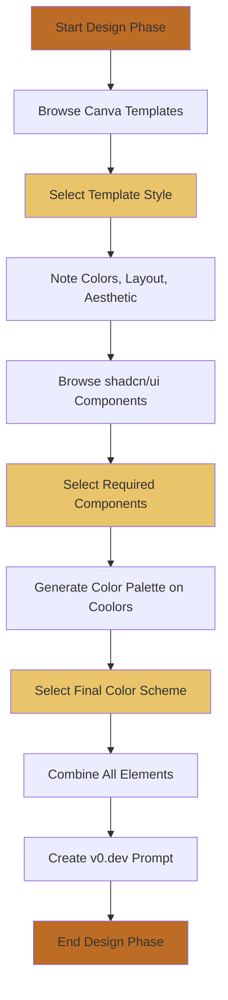
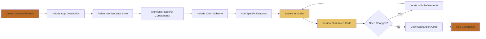
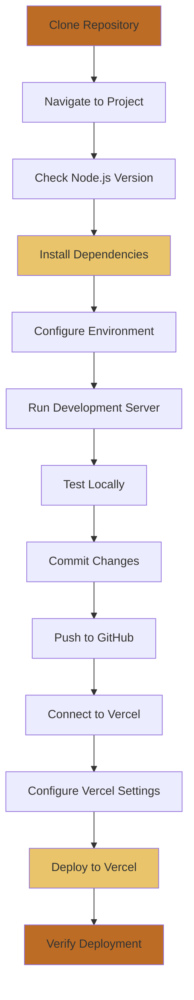
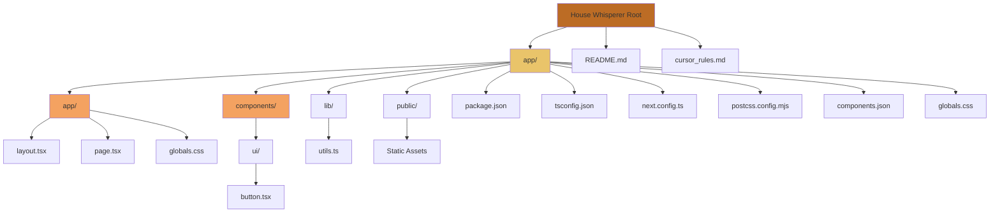
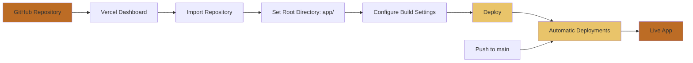

# Frontend Setup Summary - House Whisperer Vercel App

This document summarizes the complete process of creating the House Whisperer frontend application, from design inspiration to deployment on Vercel.

## Table of Contents

1. [Overview](#overview)
2. [Design Inspiration Phase](#design-inspiration-phase)
3. [v0.dev Generation](#v0dev-generation)
4. [Repository Setup](#repository-setup)
5. [Dependency Installation](#dependency-installation)
6. [Project Structure](#project-structure)
7. [Configuration Details](#configuration-details)
8. [Deployment to Vercel](#deployment-to-vercel)
9. [Key Technologies Used](#key-technologies-used)

---

## Overview

**House Whisperer** is a Next.js frontend application for an AI-powered home inspection platform. The app transforms traditional home inspections into living digital twins that compound in value over time.

### Tech Stack Summary

- **Framework**: Next.js 16.0.7 (App Router)
- **UI Components**: shadcn/ui (New York style)
- **Styling**: Tailwind CSS v4
- **Language**: TypeScript 5
- **Icons**: Lucide React
- **Deployment**: Vercel

---

## Design Inspiration Phase

Before generating code with v0.dev, design inspiration was gathered from multiple sources to ensure a cohesive and modern UI.

### Design Inspiration Workflow



### Step-by-Step Process

#### a) Pick a Template Style

1. **Visit [Canva Templates](https://www.canva.com/templates/)**
   - Browse through various design templates
   - Look for styles that match the app's purpose (professional, modern, clean)
   - Note the following elements:
     - Color combinations
     - Layout patterns
     - Typography choices
     - Overall aesthetic and mood

#### b) Choose Component Styles

1. **Go to [shadcn/ui Components](https://ui.shadcn.com/docs/components/)**
   - Browse the comprehensive component library
   - Select components needed for the app:
     - Buttons
     - Cards
     - Forms
     - Navigation elements
     - Modals/Dialogs
   - Note the component variants and styling patterns

**Selected Components for House Whisperer:**
- Button (with variants: default, outline, ghost)
- Card
- Navigation elements
- Form components (for future use)

#### c) Select a Color Scheme

1. **Visit [Coolors](https://coolors.co/)**
   - Generate or browse color palettes
   - Pick colors that match the app's mood and purpose
   - Consider accessibility and contrast ratios

**Final Color Scheme for House Whisperer:**
- **Primary**: Warm brown (#bc6c25) - `oklch(0.52 0.19 50)`
- **Background**: Cream/Off-white - `oklch(0.98 0 0)`
- **Foreground**: Charcoal - `oklch(0.18 0.02 30)`
- **Accent**: Matching warm brown tones
- **Supporting colors**: Neutral grays for borders and muted elements

This color scheme creates a warm, professional, and trustworthy aesthetic appropriate for a home inspection platform.

---

## v0.dev Generation

v0.dev is a powerful tool that generates React/Next.js frontend code based on natural language prompts.

### v0.dev Generation Workflow



### Creating the v0 Prompt

The prompt combined all design inspiration elements into a comprehensive description:

**Example Prompt Structure:**

```
Create me an app: House Whisperer

[Description of your app concept]

Use the design style similar to: [Canva template reference]

For components, use shadcn/ui with: [component names]

Color scheme: [your colors from Coolors]

[Additional specific features or requirements]
```

**Key Elements Included:**
1. App name and purpose
2. Template style reference from Canva
3. shadcn/ui component requirements
4. Color scheme from Coolors
5. Specific features (navigation, hero section, problem/solution sections, etc.)

### Generating the App

1. **Go to [v0.dev](https://v0.dev)**
2. **Paste the comprehensive prompt** in the chat interface
3. **Wait for v0 to generate** the frontend code
4. **Review the generated code** for:
   - Component structure
   - Styling implementation
   - Responsive design
   - Accessibility features
5. **Iterate if needed** - request changes or refinements:
   - Adjust colors
   - Modify layouts
   - Add/remove components
   - Refine styling

### Generated Output

v0.dev generated:
- Complete Next.js App Router structure
- React components with TypeScript
- Tailwind CSS styling
- shadcn/ui component integration
- Responsive design implementation
- Modern UI patterns

---

## Repository Setup

### Repository Setup and Deployment Flow



### Step-by-Step Setup

1. **Clone the Repository**
   ```bash
   git clone <repository-url>
   cd "House Whisperer"
   ```

2. **Navigate to App Directory**
   ```bash
   cd app
   ```

3. **Verify Prerequisites**
   - Node.js 20.9.0 or higher
   - npm or yarn package manager

---

## Dependency Installation

### Installation Process

1. **Install Dependencies**
   ```bash
   npm install
   ```

   This installs all dependencies listed in `package.json`, including:
   - Next.js framework
   - React and React DOM
   - TypeScript
   - Tailwind CSS
   - shadcn/ui components and their Radix UI dependencies
   - Form handling libraries
   - Icon libraries
   - And more...

### Key Dependencies

#### Core Framework
- `next`: 16.0.7 - Next.js framework with App Router
- `react`: 19.2.0 - React library
- `react-dom`: 19.2.0 - React DOM renderer
- `typescript`: ^5 - TypeScript compiler

#### Styling
- `tailwindcss`: ^4.1.9 - Utility-first CSS framework
- `@tailwindcss/postcss`: ^4.1.9 - PostCSS plugin for Tailwind
- `tailwind-merge`: ^3.3.1 - Merge Tailwind classes
- `tailwindcss-animate`: ^1.0.7 - Animation utilities
- `autoprefixer`: ^10.4.20 - CSS vendor prefixing

#### UI Components (shadcn/ui)
- Multiple `@radix-ui/react-*` packages - Accessible component primitives
- `class-variance-authority`: ^0.7.1 - Component variant management
- `clsx`: ^2.1.1 - Conditional class names
- `lucide-react`: ^0.454.0 - Icon library

#### Form Handling
- `react-hook-form`: ^7.60.0 - Form state management
- `@hookform/resolvers`: ^3.10.0 - Validation resolvers
- `zod`: 3.25.76 - Schema validation

#### Utilities
- `date-fns`: 4.1.0 - Date manipulation
- `cmdk`: 1.0.4 - Command menu component
- `sonner`: ^1.7.4 - Toast notifications
- `@vercel/analytics`: 1.3.1 - Vercel Analytics

### Development Dependencies

- `@types/node`: ^22 - Node.js type definitions
- `@types/react`: ^19 - React type definitions
- `@types/react-dom`: ^19 - React DOM type definitions
- `postcss`: ^8.5 - CSS post-processor
- `eslint` - Code linting

---

## Project Structure

### Directory Tree Visualization



### Detailed Structure

```
House Whisperer/
├── app/                          # Next.js application root
│   ├── app/                      # Next.js App Router directory
│   │   ├── layout.tsx            # Root layout with metadata
│   │   ├── page.tsx              # Home page component
│   │   └── globals.css           # Global styles and CSS variables
│   ├── components/               # React components
│   │   └── ui/                   # shadcn/ui components
│   │       └── button.tsx        # Button component
│   ├── lib/                      # Utility functions
│   │   └── utils.ts              # Helper functions (cn, etc.)
│   ├── public/                   # Static assets
│   │   ├── file.svg
│   │   ├── globe.svg
│   │   ├── next.svg
│   │   ├── vercel.svg
│   │   └── window.svg
│   ├── components.json           # shadcn/ui configuration
│   ├── package.json              # Dependencies and scripts
│   ├── package-lock.json         # Dependency lock file
│   ├── tsconfig.json             # TypeScript configuration
│   ├── next.config.ts            # Next.js configuration
│   ├── postcss.config.mjs        # PostCSS configuration
│   ├── eslint.config.mjs         # ESLint configuration
│   ├── next-env.d.ts             # Next.js type definitions
│   └── README.md                 # App-specific README
├── README.md                     # Main project README
├── cursor_rules.md               # Cursor IDE rules
└── FRONTEND_SETUP_SUMMARY.md     # This file
```

### Key Directories Explained

- **`app/app/`**: Next.js App Router routes and pages
- **`app/components/`**: Reusable React components
- **`app/components/ui/`**: shadcn/ui component library
- **`app/lib/`**: Utility functions and helpers
- **`app/public/`**: Static files served at root URL

---

## Configuration Details

### 1. `components.json` - shadcn/ui Configuration

Location: `app/components.json`

```json
{
  "$schema": "https://ui.shadcn.com/schema.json",
  "style": "new-york",
  "rsc": true,
  "tsx": true,
  "tailwind": {
    "config": "",
    "css": "app/globals.css",
    "baseColor": "neutral",
    "cssVariables": true,
    "prefix": ""
  },
  "iconLibrary": "lucide",
  "aliases": {
    "components": "@/components",
    "utils": "@/lib/utils",
    "ui": "@/components/ui",
    "lib": "@/lib",
    "hooks": "@/hooks"
  }
}
```

**Key Settings:**
- **Style**: "new-york" - Modern, clean component style
- **RSC**: true - React Server Components enabled
- **Base Color**: "neutral" - Neutral color base
- **CSS Variables**: true - Uses CSS variables for theming
- **Icon Library**: "lucide" - Lucide React icons
- **Path Aliases**: Configured for `@/` imports

### 2. `tsconfig.json` - TypeScript Configuration

Location: `app/tsconfig.json`

**Key Settings:**
- **Target**: ES2017
- **Module**: ESNext
- **JSX**: react-jsx
- **Path Aliases**: `@/*` maps to `./*`
- **Strict Mode**: Enabled
- **Incremental**: Enabled for faster builds

### 3. `globals.css` - Global Styles and Theme

Location: `app/app/globals.css`

**Key Features:**
- Tailwind CSS imports
- CSS custom properties for theming
- Color scheme variables (light and dark mode)
- Custom color palette:
  - Primary: `oklch(0.52 0.19 50)` - Warm brown (#bc6c25)
  - Background: `oklch(0.98 0 0)` - Cream/off-white
  - Foreground: `oklch(0.18 0.02 30)` - Charcoal
- Border radius variables
- Base layer styles

### 4. `next.config.ts` - Next.js Configuration

Location: `app/next.config.ts`

Currently uses default configuration. Can be extended for:
- Image optimization
- Environment variables
- Redirects and rewrites
- Headers configuration

### 5. `postcss.config.mjs` - PostCSS Configuration

Location: `app/postcss.config.mjs`

```javascript
const config = {
  plugins: {
    "@tailwindcss/postcss": {},
  },
};
```

Configures PostCSS to use Tailwind CSS v4's PostCSS plugin.

---

## Deployment to Vercel

### Deployment Workflow



### Step-by-Step Deployment

1. **Prepare Repository**
   - Ensure all code is committed
   - Push to GitHub repository

2. **Deploy via Vercel Dashboard**
   - Go to [vercel.com](https://vercel.com)
   - Click "Add New Project"
   - Import the GitHub repository
   - **Important**: Set **Root Directory** to `app`
   - Configure project settings:
     - Framework Preset: Next.js
     - Build Command: `npm run build` (default)
     - Output Directory: `.next` (default)
     - Install Command: `npm install` (default)

3. **Automatic Deployments**
   - Vercel automatically deploys on:
     - Initial deployment
     - Every push to `main` branch
     - Pull request creation (preview deployments)

4. **Verify Deployment**
   - Check deployment status in Vercel dashboard
   - Visit the live URL
   - Test all functionality

### Deployment Configuration

**Root Directory**: `app/`  
**Framework**: Next.js  
**Build Command**: `npm run build`  
**Output Directory**: `.next`  
**Install Command**: `npm install`

### Environment Variables

If needed, add environment variables in Vercel dashboard:
- Go to Project Settings → Environment Variables
- Add variables for:
  - API keys
  - Database URLs
  - Third-party service credentials

---

## Key Technologies Used

### Frontend Framework
- **Next.js 16.0.7**: React framework with App Router, server components, and optimized performance

### UI & Styling
- **Tailwind CSS v4**: Utility-first CSS framework
- **shadcn/ui**: High-quality React component library
- **Radix UI**: Accessible component primitives (used by shadcn/ui)
- **Lucide React**: Icon library

### Language & Type Safety
- **TypeScript 5**: Type-safe JavaScript
- **Zod**: Schema validation

### Form Handling
- **React Hook Form**: Performant form library
- **@hookform/resolvers**: Validation resolvers

### Development Tools
- **ESLint**: Code linting
- **PostCSS**: CSS processing
- **Autoprefixer**: CSS vendor prefixing

### Deployment & Analytics
- **Vercel**: Hosting and deployment platform
- **Vercel Analytics**: Web analytics

### Utilities
- **class-variance-authority**: Component variant management
- **clsx**: Conditional class names
- **tailwind-merge**: Merge Tailwind classes intelligently
- **date-fns**: Date manipulation library

---

## Development Workflow

### Local Development

1. **Start Development Server**
   ```bash
   cd app
   npm run dev
   ```

2. **Open Browser**
   - Navigate to [http://localhost:3000](http://localhost:3000)

3. **Make Changes**
   - Edit files in `app/` directory
   - Changes hot-reload automatically

### Building for Production

```bash
cd app
npm run build
npm start
```

### Code Quality

- **Linting**: `npm run lint`
- **Type Checking**: Built into TypeScript compilation
- **Formatting**: Follow project conventions

---

## Summary

This frontend application was created through a systematic process:

1. **Design Inspiration**: Gathered from Canva templates, shadcn/ui components, and Coolors color palettes
2. **Code Generation**: Used v0.dev to generate initial Next.js application structure
3. **Setup**: Cloned repository and installed dependencies
4. **Configuration**: Configured TypeScript, Tailwind, shadcn/ui, and Next.js
5. **Deployment**: Deployed to Vercel with automatic CI/CD

The result is a modern, responsive, and maintainable Next.js application ready for production use.

---

**Last Updated**: Generated during initial project setup  
**Maintained By**: House Whisperer Development Team

